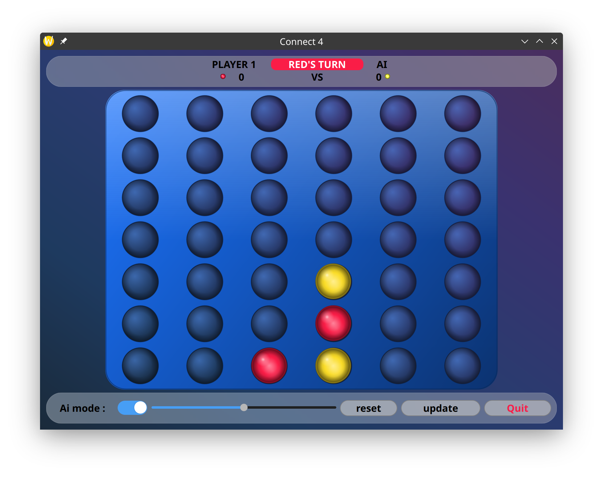

# Connect 4 — Modern Edition

A polished Qt/C++ Connect 4 game with an alpha-beta AI opponent, animated UI, and built-in auto-updater.



---

## Features

| Feature | Details |
|---|---|
| **AI opponent** | Alpha-beta minimax, depth-configurable via slider (2–8), center-column heuristic, immediate win/block detection |
| **Two-player mode** | Pass-and-play on the same machine |
| **Mid-game AI toggle** | Enable AI at any point in a PvP game — it picks up as the next Yellow move immediately |
| **Win overlay** | Animated overlay on the game page; winning pieces are highlighted, board stays visible |
| **Draw detection** | Detects and announces a full-board draw |
| **Score tracking** | Per-session score counters for both players |
| **Animated pieces** | Bouncing drop animation with `OutBounce` easing |
| **Floating logo** | Home-screen logo floats with layout-aware repositioning |
| **Auto-updater** | Checks GitHub Releases on startup, downloads the right platform asset, launches the installer |

---

## Project structure

```
Connect4/
├── CMakeLists.txt
├── src/            # All C++ source and header files
│   ├── main.cpp
│   ├── gameengine.cpp / .h
│   ├── connect_4.cpp / .h
│   ├── ai.cpp / .h
│   ├── aihelper.cpp / .h
│   ├── piece.cpp / .h
│   └── ...         # UI widget files
├── form/           # Qt Designer UI files
│   └── gameengine.ui
└── Images/
    └── screenshot.png
```

---

## Dependencies & installation

### Debian / Ubuntu (and derivatives)

```bash
sudo apt update
sudo apt install -y \
    build-essential \
    cmake \
    ninja-build \
    qt6-base-dev \
    qt6-tools-dev \
    qt6-tools-dev-tools \
    libqt6network6 \
    libqt6concurrent6
```

> **Qt 5 fallback** — if Qt 6 is not available on your distro:
> ```bash
> sudo apt install -y qtbase5-dev qttools5-dev
> ```

### Windows

1. Download and run the [Qt Online Installer](https://www.qt.io/download-qt-installer).
2. Select **Qt 6.x → MSVC 2019 64-bit** (or MinGW 64-bit).
3. Also install **CMake** (bundled in the Qt installer, or from [cmake.org](https://cmake.org/download/)).
4. Open **Qt Creator** or a Developer Command Prompt and follow the build steps below.

> **MinGW alternative** — if you prefer not to install MSVC, choose the MinGW kit in the Qt installer and ensure `mingw64/bin` is on your `PATH`.

### macOS

```bash
# Install Homebrew if needed: https://brew.sh
brew install qt cmake ninja
# Make Qt findable by CMake
export PATH="$(brew --prefix qt)/bin:$PATH"
```

---

## Building

```bash
git clone https://github.com/YOUR_GITHUB_USER/connect4.git
cd connect4
cmake -B build -DCMAKE_BUILD_TYPE=Release
cmake --build build --parallel
```

Run:
```bash
./build/connect4          # Linux / macOS
build\connect4.exe        # Windows
```

### Qt Creator (all platforms)

1. Open **CMakeLists.txt** in Qt Creator.
2. Configure the kit (Qt 6 or Qt 5.15+).
3. Click **Build** → **Run**.

---

## AI design

The AI is always **Player 2 (Yellow)**. It uses **alpha-beta pruning** on a minimax tree:

- **Depth** is set by the difficulty slider (2 = fast/easy, 8 = strong).
- **Move ordering** checks center columns first (`{2,3,1,4,0,5}`) to maximise pruning efficiency.
- **Immediate checks** before full search: win-in-one → block-in-one → full search.
- **Evaluation** scores every 4-cell horizontal/vertical/diagonal window across the board.
- **Terminal guards** detect already-won or full boards at the top of every node so the search never crashes on a nearly-full board.
- **Fallback move** ensures the AI always plays something valid even on a completely evaluated losing path.

### Known limits

- The AI does not detect **double-threat forks** at low depths (depth < 5). Increase the slider for stronger play.
- At depth 8 on a nearly-empty board the search can take 1–3 seconds; the UI remains responsive because computation runs on a dedicated `QThread`.

---

## License

MIT — see `LICENSE`.
